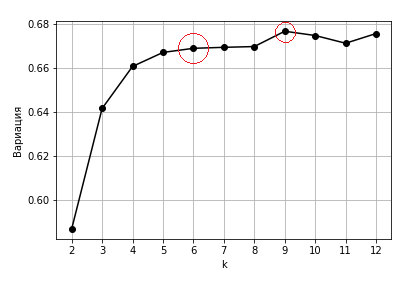
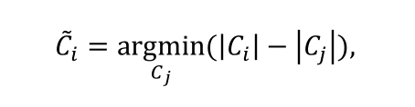
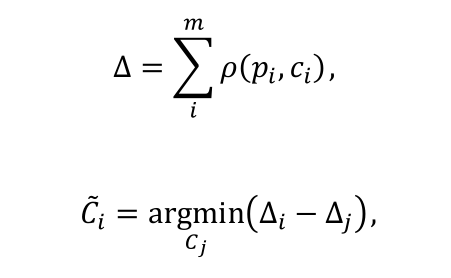
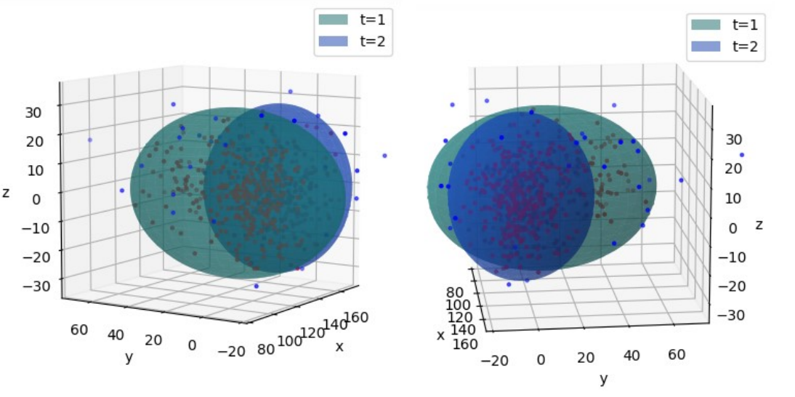

# Modelling dynamics of retail customer clusters
## Intro

This was my bachelor thesis at Bauman Moscow State Technical University (BMSTU). The idea behind is to clusterise customers and to model their behaviour throughout a given period of time. The data used in this project was provided to the department by a Russian network of grocery shops. 

Source files: 15 csv-files containing anonymised receipts of customers. Each of the files had around 1 million rows.
## Data preparation
### Data cleaning
Excerpt from one of the files  

Columns:
- shop id;
- receipt date; 
- receipt id;
- product id;
- product name;
- quantity;
- price;

The table looks fine and seems like no data cleaning is needed. However, if values are printed, the opposite is evident.

The notebook which contains data cleaning part is [here](https://github.com/emyhr/Retail_clusters_dynamics/blob/master/file_refiner.ipynb)  
After cleaning the data file sizes decreased 1.5 times.
|File|Size before cleaning(kb)|Size after cleaning(kb)|  
|:---:|:---:|:---:|
|1|1 005 926|630 639| 
|2|1 239 462|787 221|  
|3|594 244|375 117|  
|4|1 920 671|1 218 908|  
|5|383 151|240 953|
|6|681 931|434 843|  
|7|636 644|409 472|  
|8|452 536|285 073|  
|9|852 451|538 738|  
|10|890 994|562 112|  
|11|847 766|536 733|  
|12|1 522 345|972 821|  
|13|502 756|319 804|  
|14|2 061 362|1 315 503|  
|15|1 840 329|1 175 503|

### Splitting products into sections
Next step, is splitting products into sections(categories). The following categories have been chosen:
- alcohol;
- pet products;
- bakery;
- non-alcoholic beverages;
- cheese and sausages;
- tobacco;
- condiments;
- confectionery;
- semi-finished products;
- seafood;
- frozen products;
- fruits and vegetables;
- groceries;
- household;
- products for children;
- dairy products;
- meat;
- salads;
- snacks;
- detergents;
- others;

For sorting, I used 're' Python library. The algorithm is the following:
1. For each section, two lists were created: one contained keywords of the category, another one contained keywords that definitely didn't belong to the category;
2. Product name and product id are read;
3. Product name is tested for containment of keywords from the first list and for absence of values from the second list;
4. If the previous condition is satisfied, the product id is written to the file of that category.
The code can be found [here](https://github.com/emyhr/Retail_clusters_dynamics/blob/master/sorting_products.ipynb).

|Category|Number of products|
|:---:|:---:|
|alcohol|1495|
|pet products|141|
|bakery|828|
|non-alcoholic beverages|1430|
|cheese and sausages|363|
|tobacco|128|
|condiments|412|
|confectionery|1193|
|semi-finished products|223|
|seafood|273|
|frozen products|204|
|fruits and vegetables|722|
|groceries|454|
|household|252|
|products for children|92|
|meat|308|
|dairy products|1297|
|salads|2820|
|snacks|189|
|detergents|642|
|others|204|

## Building the model
We have a set of customers(receipts) P with elements pi, i=1, ..., N, where N - number of customers(receipts). For each pi, there is a vector of numbers pi = {p1, p2, p3, ..., pr}, where r - number of categories(equals 21). Btw, in vector p's coordinates, superscripts don't signify powers but indices (as it is the case in maths sometimes). Values pi are the numbers of product items customer purchased from the corresponding category. In this model, euclidean metrics is used for distance calculations.

## Time points
Provided files contained list of receipts of one year. To increase the volume of the sample in a time point, three days were merged into a single time point. The code is [here](https://github.com/emyhr/Retail_clusters_dynamics/blob/master/time_period.ipynb).

## Vector initialisation
1. Consider one receipt. Extract list of product ids;
2. Extract list of product ids of the first category;
3. Count number of product ids of that category contained in the list of product ids in the receipt. Assign the result to the first coordinate of the vector;
4. Repeat step 3 for all of the categories;
5. Repeat the whole process for each receipt.

Code of vector initialisation is given [here](https://github.com/emyhr/Retail_clusters_dynamics/blob/master/init_coord.ipynb).

## Clustering

For clustering, [KMeans](https://en.wikipedia.org/wiki/K-means_clustering) algorithm was used. I think, everyone knows how it works, if someone doesn't, just follow the given link. The implementation code of this and all of the others methods and algorithms used in this work is given in this [module](https://github.com/emyhr/Retail_clusters_dynamics/blob/master/coursework.py).  
Here, it is applied on the sample of one of the time points with k=3.

  
But the question is how do we know what k to choose? What number of clusters will optimal? [Elbow method](https://en.wikipedia.org/wiki/Elbow_method_(clustering)) is your friend here. Since not so many people know about the Elbow method, let me explain it right here. So, the main idea is to choose such number of clusters, that adding one more cluster will not improve the model. In the Elbow method, different criteria can be used for determining the optimal k. I used two: average distance from points to cluster centroid and variance explained.

### Average distance criterion

First, we need to calculate the distances between each point and the centroid of the cluster the point belongs to. Then, the average of those distance is computed. Now, we plot the graph with the number of clusters k as X-axis and the average distance as Y-axis. Let's plot this graph for the dataset of one day.  
  
At some value of k=koptimal, we can see significant drop of the average distance, after which the slope becomes more smooth, uniform. Exactly this values k is considered optimal. In this case, it is k=6. The logic behind is that if we divide the sample into 6 clusters, those clusters will be more closely grouped. However, this value should not be very big or small(one cluster - the biggest avg distance, as many clusters as points - avg distance is 0). 

### Variance explained

For better understanding of this part, we need to introduce several [notions](http://davidmlane.com/hyperstat/B160638.html):
1. Sum of Squares Between Groups  
SSB = &sum;i=1kmi(Mi-GM)2,
where mi - cluster cardinality, Mi - average cluster value, GM - global average value (of the whole dataset).
2. Sum of Squares Total  
SST = &sum;i=1n(pi-GM),
where pi - element from the dataset.
3. Variance explained  
Var = SSB/SST  

For each k, variance explained is computed. Again, we need to plot a graph with k as X-axis, and Variance explained as Y-axis. Let's consider the same dataset as before.  
  
Here, we also see a leap and smooth growth of the function. However, this time, there are two points that draw our attention. The first one is also k=6 as in the previous case, second one is k=9. It turns out, it is not as obvious as before. Nevertheless, according to the "elbow" rule, we need to choose a point after which speed of growth(decrease) of the function sinks, which is satisfied, strictly speaking, only at k=6, because after k=9, the function not just reduces its speed of growth but itself starts to decrease. Later, after k=11, the function behaves unstable. The code is in the [module](https://github.com/emyhr/Retail_clusters_dynamics/blob/master/coursework.py). 

Another method, which I've implemented is Silhoette Score. It shows how well each element was clustered. Silhoette Score value shows the similarity of the element with its cluster compared to other clusters. You can read more about the method [here](https://en.wikipedia.org/wiki/Silhouette_(clustering)).

## Dimensionality reduction. The PCA Method

As I have already mentioned in the model description, we are working with high-dimensional data. Each category is a dimension, thus, we have 21 dimensions. But how do we visualise 21-dimensional objects? We use [PCA](https://en.wikipedia.org/wiki/Principal_component_analysis). There are quite a number of articles on Medium explaining the method, so I won't do it here(also writing maths expressions in markdown is not enjoyable). I couldn't find the one I read to understand the algorithm but most of them are quite good. I definitely recommend getting familiar with PCA.  
You have already seen the results of PCA applied to the dataset, in the clustering section. However, let's look at some pictures again.  
Scale down to 2 dimensions  
  
Scale down to 3 dimensions  

## Multidimensional ellipsoid

This part was actually made by me, and I didn't read it out anywhere. So, the idea my supervisor and I had, was to approximate the clusters with ellipsoids, and then try to model just the ellipsoids.  
This is the equation of an ordinary 3-dimensional ellipsoid:  
x2/a2 + y2/b2 + z2/c2 = 1  
So, for multidimensional version, it will be:  
&sum;i=1rXi2/ai2=1, where Xi - space coordinates, ai - corresponding semi-axes.  
The main task is defining the semi-axes in such a way that the ellipsoid would capture the biggest possible number of points and still would have minimal size. Since the cetroid of a cluster is defined as a mean of all the cluster points, we can take it as the centre of the ellipsoid. Corresponding standard deviations &sigma;i will serve as the semi-axes. Final equation will look like this  
 

For visualising I used the PCA method. The dimensionality was reduced to 3, clustering was conducted using k-means. As a result of the previous actions, we had clusters in 3D space. Let's try covering one of them with an ellipsoid. 
  
The fraction of points which are inside the ellipsoid is 20%. Information about the other clusters is given in the following table:
|Cluster #|% points inside the ellipsoid|Total number of points in the cluster|
|:---:|:---:|:---:|
|1|15|85|
|2|20|103|
|3|14|126|
|4|36|5926|
|5|29|131|
|6|33|598|  

As we can see, percentage of cluster points included in the ellipsoid is less than a half, on average among all clusters it is less than a quarter. Thus, semi-axes have to be increased at minimum size of the ellipsoids. The enlargement is done according to these steps:
1. Set a threshold of 95% of all cluster points to be included inside the ellipsoid;
2. Count the number of points inside the ellipsoid;
3. Assign new values to the semi-axes proportional to the old values(it is done to preserve the shape of the ellipsoid which is optimal for the corresponding cluster):  
anew i = ai&omega;, &omega; - enlargement coefficient;
4. Repeat the process until the threshold is reached.  
By applying the steps above to the shown cluster, I got the following result.  
  
In this case, the percentage of points which are covered by the ellipsoid is 95.1%.  
Remember, we can apply this algorithm to ellipsoids of any dimensionality. In the example, I chose a 3D ellipsoid for the sake of visualisation. The code is [here](https://github.com/emyhr/Retail_clusters_dynamics/blob/master/visualisation.ipynb).

## Correspondence of clusters

To build the model of cluster dynamics, we need to establish correspondence between them in different points of time.

Criteria of similarity:

* cardinality (number of customers shouldn't be volatile meaning the number of people buying some set of products cannot change dramatically in 3 days)  

* density (density should stay almost the same meaning customers of a cluster should behave similarly)

In this work, I used cardinality criterion. Let's establish correpondence between clusters in first two time points.

On the figure, you can see approximation of the first cluster in different time points. It is noticable that approximating ellipsoid has changed its shape in the second time point. Let's figure out why:  
* Counting number elements of the cluster:
  + t=1: 311 elements  
  + t=2: 335 elements  
  So number of elements has barely changed. Let's check another criterion: density  
* Density (distance of cluster points from its centroid):
  + t=1: 7190.1  
  + t=2: 6418.4  
  Comparing semi-axes of the two ellipsoids:  
  + t=1: (12.3; 19.4; 10.6)  
  + t=2: (12.9; 12.1; 10.6)  
Now, it's clear, why ellipsoid got squeezed in t=2 - density has decreased, hence, second semi-axis significantly decreased whereas the other semi-axes stayed the same.
 

 
